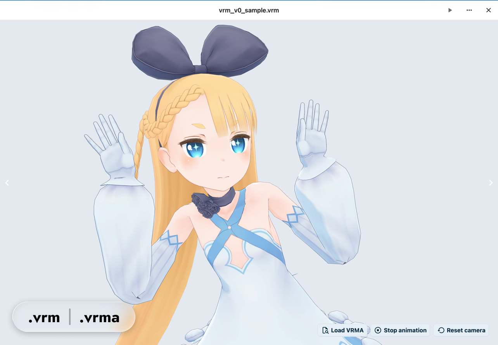

# Nextcloud用 VRM Viewer

[English](README.md)



VRM Viewerは、NextcloudのFiles画面から`.vrm`アバターファイルを直接開ける
対話型3Dビューアーです。VRM 0.x、VRM 1.0、埋め込みVRMサムネイル、同じ
Nextcloudインスタンス内に保存された`.vrma`アニメーションの再生に対応します。

## 機能

- Nextcloud Filesアプリから`.vrm`ファイルを開く
- Three.jsと`@pixiv/three-vrm`でVRM 0.x／VRM 1.0モデルをプレビュー
- 上腕を下げたAポーズへモデル姿勢を統一
- カメラの回転、パン、ズーム、リセット
- Nextcloud内の`.vrma`アニメーションファイルを選択してループ再生
- Nextcloud Viewer内でVRMファイル間を前後移動
- VRMに埋め込まれたPNG／JPEGサムネイルをFiles一覧へ表示
- 破損ファイル、ダウンロード失敗、WebGL非対応のエラー表示
- 外部CDNから実行時ライブラリやモデルアセットを読み込まないブラウザー内レンダリング

## 要件

- Nextcloud 34
- Filesアプリを利用できるログイン済みユーザー
- WebGL対応ブラウザー
- 選択ファイルへの同一オリジンWebDAVアクセス
- 自己完結したGLBベースのVRM／VRMAファイル

外部GLBリソースを参照するファイルは拒否します。有効な埋め込みサムネイルがないVRMは、
Files一覧で標準のファイルアイコンへフォールバックします。このアプリは、サーバー側で
モデルをレンダリングして新しいサムネイルを生成する処理は行いません。

## インストール

GitHub Releaseから`files_vrmviewer-1.0.0.tar.gz`をダウンロードし、Nextcloudの
`custom_apps`ディレクトリへ展開します。

```bash
tar -xzf files_vrmviewer-1.0.0.tar.gz -C /path/to/nextcloud/custom_apps
sudo -u www-data php /path/to/nextcloud/occ app:enable files_vrmviewer
```

アプリ独自の`.vrm`向けファイルアクションを含むため、カスタムMIME設定を追加しなくても
利用できます。

## 使い方

1. Nextcloud Filesアプリを開きます。
2. `.vrm`ファイルをクリックするか、ファイルアクションメニューから`Open in VRM Viewer`を選びます。
3. Viewer上でカメラの回転、パン、ズーム、リセットを操作します。
4. `Load VRMA`をクリックして、Nextcloud内の`.vrma`ファイルを選択します。
5. `Stop animation`をクリックすると、現在のVRMA再生を停止できます。

VRMAファイルピッカーにはフォルダーと`.vrma`ファイルだけが表示されます。子ディレクトリ内の
アニメーションを参照でき、無関係なファイルは一覧に表示されません。

## 任意のMIME設定

Nextcloud全体で`.vrm`を専用MIMEとして扱いたい場合は、既存内容を消さずに以下を
マージしてください。

`config/mimetypemapping.json`:

```json
{
  "vrm": ["model/vrm"]
}
```

`config/mimetypealiases.json`:

```json
{
  "model/vrm": "file"
}
```

設定後にNextcloudのMIMEキャッシュを更新します。

```bash
sudo -u www-data php occ maintenance:mimetype:update-db --repair-filecache
sudo -u www-data php occ maintenance:mimetype:update-js
```

## 制限

以下はv1.0.0の対象外です。

- 公開共有リンクからのVRMファイル表示
- ブラウザーからのローカルVRMAファイル直接選択
- アニメーション速度変更
- 表情またはブレンドシェイプ編集
- 埋め込みサムネイルがないVRM向けのサーバー側レンダリングサムネイル生成

## 開発

Node.js 24とnpm 11を使用します。

```bash
npm ci
npm run build
npm run typecheck
npm run lint
npm run stylelint
npm test
```

ローカルNextcloud 34環境:

```bash
npm run build
npm run docker:up
npm run docker:setup
npx playwright install chromium
npm run test:e2e
npm run docker:down
```

E2Eセットアップでは固定された上流VRM／VRMAサンプルをダウンロードし、SHA-256を
検証します。サンプルバイナリはこのリポジトリには保存しません。

## パッケージング

```bash
npm run package
```

以下が生成されます。

- `build/artifacts/files_vrmviewer-1.0.0.tar.gz`
- `build/artifacts/files_vrmviewer-1.0.0.tar.gz.sha256`

リリースタグは`package.json`と`appinfo/info.xml`のバージョンと一致している必要があります。
たとえばバージョン`1.0.0`はタグ`v1.0.0`でリリースします。

## プライバシーとネットワーク挙動

VRM／VRMAファイルはユーザーのNextcloud WebDAVエンドポイントから読み込まれます。
実行時レンダリングはブラウザー内で行われ、このアプリはレンダリングライブラリやモデル
アセットを外部CDNから意図的に取得しません。

## ライセンス

MIT
